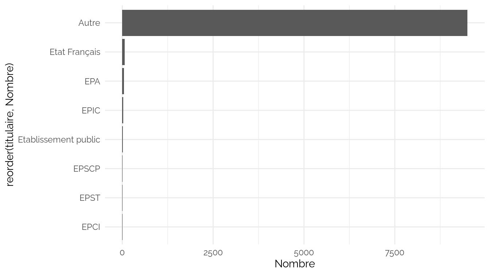
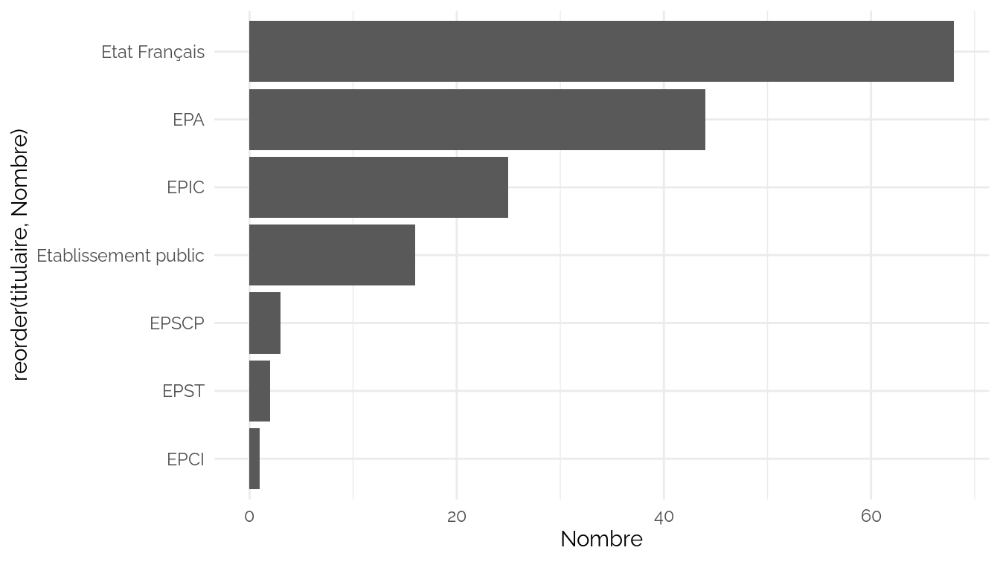
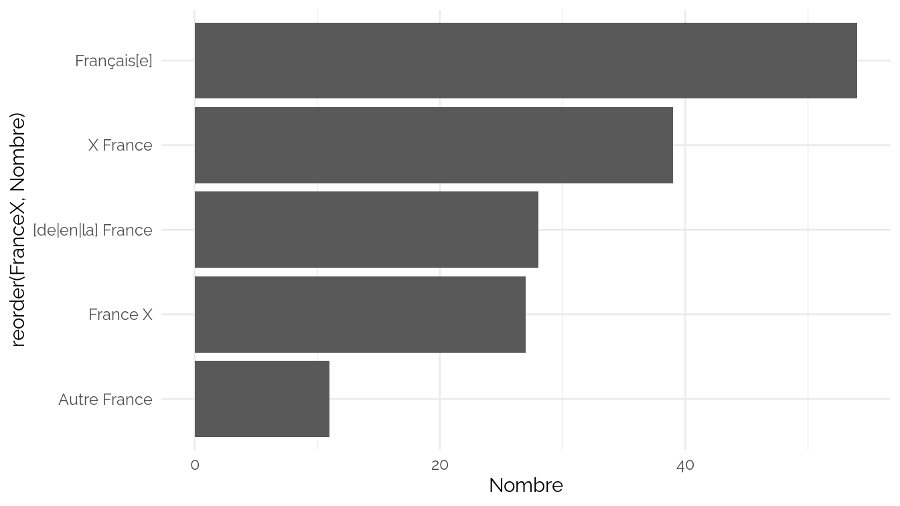
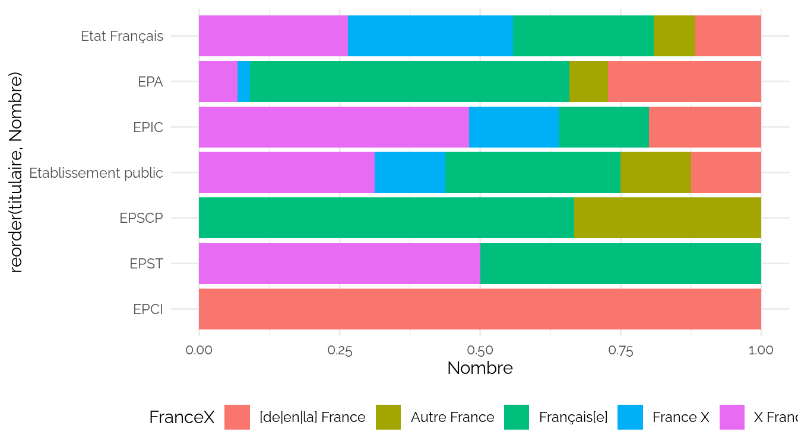

INPI FranceX
================
CPESR
2024-06-01

## Search

- <https://www.inpi.fr/sites/default/files/Inpi_doc_tech_API_PI_v1.0_0.pdf>

<!-- -->

    ##  [1] "ApplicationNumber"     "Mark"                  "MarkCurrentStatusCode"
    ##  [4] "ApplicationDate"       "ExpiryDate"            "DEPOSANT"             
    ##  [7] "DEPOTIT"               "MarkFeature"           "url"                  
    ## [10] "search"                "FranceX"               "depo"                 
    ## [13] "titulaire"

FranceX

| FranceX               | Nombre |
|:----------------------|-------:|
| Sans France           |  14291 |
| \[de\|en\|la\] France |   9158 |
| X France              |   9105 |
| France X              |   5187 |
| Autre France          |   4680 |
| Français\[e\]         |    248 |

Titulaire

| titulaire            | Nombre |
|:---------------------|-------:|
| Autre                |  27956 |
| Etablissement public |   5263 |
| EPA                  |   3355 |
| EPIC                 |   2741 |
| Etat Français        |   1897 |
| EPSCP                |    637 |
| EPCI                 |    610 |
| EPST                 |    210 |

MarkCurrentStatusCode

| MarkCurrentStatusCode                               | Nombre |
|:----------------------------------------------------|-------:|
| Marque expirée                                      |  24224 |
| Marque enregistrée                                  |   9780 |
| Marque renouvelée                                   |   5018 |
| Demande totalement rejetée                          |   1854 |
| Marque ayant fait l'objet d'un retrait total        |    858 |
| Demande publiée                                     |    472 |
| Marque ayant fait l'objet d'une renonciation totale |    435 |
| Demande irrecevable après publication               |     12 |
| Marque annulée                                      |     11 |
| Renouvellement demandé                              |      5 |

### Plots

France / Marques actives

France / Marques actives / Public

## FranceX Notices

    ##  [1] "Mark"                    "Operation"              
    ##  [3] "RegistrationOfficeCode"  "ApplicationNumber"      
    ##  [5] "ApplicationDate"         "FilingPlace"            
    ##  [7] "ApplicationLanguageCode" "ExpiryDate"             
    ##  [9] "MarkCurrentStatusCode"   "MarkFeature"            
    ## [11] "ClassificationKindCode"  "ClassDescription"       
    ## [13] "ApplicantCount"          "ApplicantLegalEntity"   
    ## [15] "IndividualIdentifier"    "OrganizationName"       
    ## [17] "AddressCity"             "AddressCountryCode"

Top organization

| OrganizationName                                                          | Nombre |
|:--------------------------------------------------------------------------|-------:|
| france alzheimer et maladies apparentées                                  |    103 |
| france télévisions                                                        |     19 |
| radio france                                                              |     10 |
| centre international d’études pédagogiques                                |     10 |
| france diffusion                                                          |      8 |
| cosmetic valley                                                           |      6 |
| fédération des particuliers employeurs de france (fepem)                  |      6 |
| association france active                                                 |      6 |
| fédération des industries nautiques                                       |      5 |
| france.tv studio                                                          |      4 |
| alphamedia &johanet                                                       |      4 |
| syndicat français de l’industrie cimentière                               |      4 |
| france enseignes et signalisations sarl                                   |      4 |
| l’institut français de la communication et du marketing au point de vente |      4 |
| conférence des présidents d’université                                    |      4 |

Top IndividualIdentifier

| IndividualIdentifier | Nombre |
|---------------------:|-------:|
|                   NA |    514 |
|            337969646 |    103 |
|            432766947 |     18 |
|            326094471 |     10 |
|            515180909 |      8 |
|            180043069 |      7 |
|            344891668 |      7 |
|            799993043 |      6 |
|            784855264 |      6 |
|            351489059 |      5 |
|            414986356 |      4 |
|            504248626 |      4 |
|            879689883 |      4 |
|            448138610 |      4 |
|            425128261 |      3 |

Top ApplicantLegalEntity

| ApplicantLegalEntity                            | Nombre |
|:------------------------------------------------|-------:|
| NA                                              |    331 |
| association loi 1901                            |    147 |
| sas                                             |    124 |
| sarl                                            |     60 |
| association                                     |     51 |
| société par actions simplifiée                  |     48 |
| société anonyme                                 |     37 |
| sasu                                            |     23 |
| société à responsabilité limitée                |     15 |
| association loi de 1901                         |     14 |
| syndicat patronal                               |     13 |
| association déclarée                            |     10 |
| etat français                                   |     10 |
| société par actions simplifiée à associé unique |     10 |
| etablissement public administratif              |      9 |

## Stats

\`
