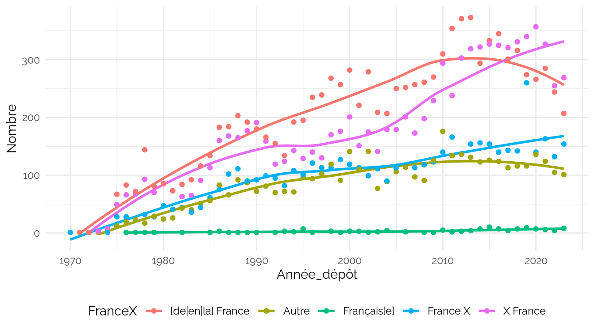

INPI FranceX
================
CPESR
2024-05-30

## Données

- <https://www.inpi.fr/sites/default/files/Inpi_doc_tech_API_PI_v1.0_0.pdf>

<!-- -->

    ## [1] "ApplicationNumber"     "Mark"                  "MarkCurrentStatusCode"
    ## [4] "ApplicationDate"       "ExpiryDate"            "DEPOSANT"             
    ## [7] "MarkFeature"           "FranceX"

## Explorations

FranceX

| FranceX               | Nombre |
|:----------------------|-------:|
| France X              |   5178 |
| \[de\|en\|la\] France |  10668 |
| X France              |   9252 |
| Autre                 |   4419 |
| Français\[e\]         |    131 |

MarkCurrentStatusCode

| MarkCurrentStatusCode                               | Nombre |
|:----------------------------------------------------|-------:|
| Demande publiée                                     |    463 |
| Marque ayant fait l'objet d'un retrait total        |    728 |
| Marque enregistrée                                  |   7541 |
| Demande totalement rejetée                          |   1814 |
| Marque ayant fait l'objet d'une renonciation totale |    375 |
| Marque annulée                                      |     12 |
| Demande irrecevable après publication               |      9 |
| Marque renouvelée                                   |   2634 |
| Marque expirée                                      |  16068 |
| Renouvellement demandé                              |      4 |

    ## `geom_smooth()` using method = 'loess' and formula = 'y ~ x'

